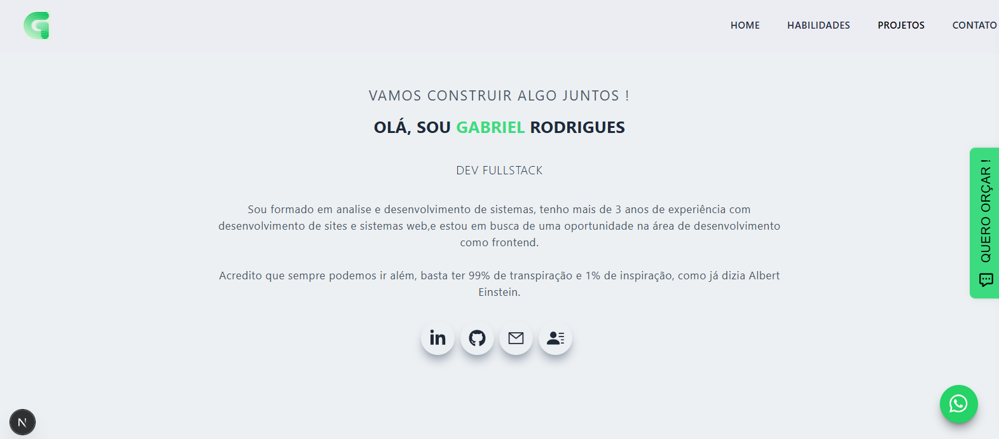

# Gabriel Rodrigues | Portfólio


## Configuração do DatoCMS

Copie `.env.example` para `.env.local` e informe um token somente de leitura:

```env
DATOCMS_API_TOKEN=seu_token_aqui
```

O token precisa ter a permissão **Access the Content Delivery API**. Reinicie o
servidor de desenvolvimento depois de alterar variáveis de ambiente.

Portfólio pessoal desenvolvido para apresentar minha trajetória como desenvolvedor fullstack, reunir projetos, destacar tecnologias utilizadas e centralizar canais de contato profissional.



## Sobre o projeto

O projeto funciona como uma vitrine profissional, com uma interface focada em navegação simples, identidade visual própria e conteúdo dinâmico vindo do DatoCMS. A página inicial apresenta uma introdução, lista de habilidades, projetos em destaque e uma área de contato.

Além da home, o portfólio possui páginas individuais para projetos, permitindo apresentar descrição, tecnologias, imagens, links para o projeto publicado e repositório de código.

## Tecnologias utilizadas

- Next.js
- React
- TypeScript
- Tailwind CSS
- DatoCMS
- GraphQL
- React Icons
- React Slick
- Nodemailer

## Conteúdo apresentado

- Apresentação profissional
- Stack e habilidades técnicas
- Projetos cadastrados via CMS
- Páginas individuais para detalhes dos projetos
- Links para deploy, código, LinkedIn, GitHub e e-mail
- Seção de contato para oportunidades, freelances e conexões profissionais

## Integração com CMS

Os projetos e tecnologias são consumidos pela API GraphQL do DatoCMS. A aplicação usa geração estática com revalidação, permitindo manter o conteúdo atualizado sem precisar alterar diretamente o código a cada novo projeto publicado.

## Deploy

Projeto publicado na Vercel:

[gabrielrodrigues.vercel.app](https://gabrielrodrigues.vercel.app/)
